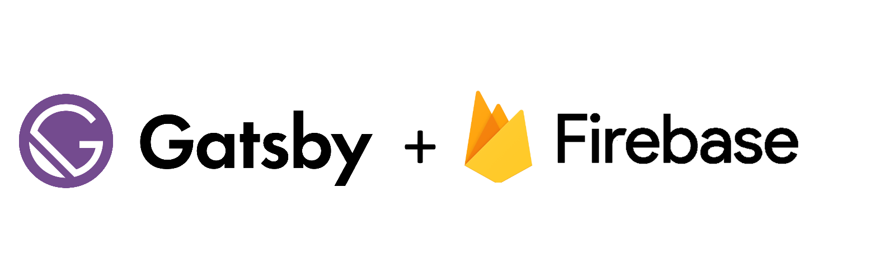

<div align="center">
    
</div>

# Gatsby Firebase Authentication Starter

This is a gatsby starter to show how an **authentication workflow** is implemented in Gatsby using [Firebase](https://firebase.google.com/) as authentication provider.

🚀 Here a [live demo](https://gatsby-firebase-simple-auth.netlify.com/) of the site.

This starter follows the best practices described in the official gatsby site: 
* [Client-only Routes](https://www.gatsbyjs.org/docs/client-only-routes-and-user-authentication/) doc
* [User Authentication](https://www.gatsbyjs.org/tutorial/authentication-tutorial/) tutorial

It uses [Gatsby Plugin Firebase](https://www.gatsbyjs.org/packages/gatsby-plugin-firebase/) v0.2 to import and set firebase SDK, and [Gatsby Plugin Create Client Path](https://www.gatsbyjs.org/packages/gatsby-plugin-create-client-paths) to set private routes.

How it works in short:
- Gatsby renders all unauthenticated routes as usual static pages.
- Authenticated routes are whitelisted as client-only (in this starter all dynamic pages are under the path 'mysite.com/app/*').
- Logged-out users are redirected to the login page if they attempt to visit private routes.
- Logged-in users will see their private content.

# Getting started with Firebase

Copy and rename `.env.sample` to `.env.development` and `.env.production` in your root directory. Use these environment variables for Firebase:

```
GATSBY_FIREBASE_API_KEY=<YOUR_FIREBASE_API_KEY>
GATSBY_FIREBASE_AUTH_DOMAIN=<YOUR_FIREBASE_AUTH_DOMAIN>
GATSBY_FIREBASE_DATABASE_URL=<YOUR_FIREBASE_DATABASE_URL>
GATSBY_FIREBASE_PROJECT_ID=<YOUR_FIREBASE_PROJECT_ID>
GATSBY_FIREBASE_STORAGE_BUCKET=<YOUR_FIREBASE_STORAGE_BUCKET>
GATSBY_FIREBASE_MESSAGING_SENDER_ID=<YOUR_FIREBASE_MESSAGING_SENDER_ID>
GATSBY_FIREBASE_APP_ID=<YOUR_FIREBASE_APP_ID>
```

- Get your Firebase environment variables by [creating a Firebase project](https://firebase.google.com/docs/web/setup)
- More information about [how Firebase works in a website](https://firebase.google.com/docs/projects/learn-more)
- Features of [Firebase authentication](https://firebase.google.com/docs/auth)
- Note that environment variables that need to be available in the browser [have to be prefixed](https://www.gatsbyjs.com/docs/environment-variables/#client-side-javascript) with `GATSBY_`

# Start developing

```
npm install
gatsby develop 
```

# Contributing
If you want to contribute to this starter, consider:

- Reporting bugs and errors
- Improve the documentation
- Creating new features and pull requests

<a href="https://www.buymeacoffee.com/marcomelilli"></a>

All contributions are welcome!
